<!-- docs/examples.md -->

# Examples

This document provides an overview and explanation of the included examples. Each example demonstrates various aspects of using PynneX, from basic emitter-listener handling to more complex threaded worker patterns and UI integrations.

## Requirements

PynneX requires **Python 3.10** or higher, plus a running `asyncio` event loop for any async usage.

## Table of Contents
  
- [Examples](#examples)
  - [Requirements](#requirements)
  - [Table of Contents](#table-of-contents)
    - [emitter\_basic.py (source)](#emitter_basicpy-source)
  - [emitter\_async.py (source)](#emitter_asyncpy-source)
  - [emitter\_function\_listeners.py (source)](#emitter_function_listenerspy-source)
  - [emitter\_lambda\_listeners.py (source)](#emitter_lambda_listenerspy-source)
  - [thread\_basic.py (source)](#thread_basicpy-source)
  - [thread\_worker.py (source)](#thread_workerpy-source)
  - [stock\_monitor\_simple.py (source)](#stock_monitor_simplepy-source)
  - [stock\_monitor\_console.py (source)](#stock_monitor_consolepy-source)
  - [stock\_monitor\_ui.py (source)](#stock_monitor_uipy-source)
  - [stock\_core.py (source)](#stock_corepy-source)
  - [fastapi\_socketio\_simple.py (source)](#fastapi_socketio_simplepy-source)
  - [fastapi\_socketio\_qr.py (source)](#fastapi_socketio_qrpy-source)
  - [fastapi\_socketio\_stock\_monitor.py (source)](#fastapi_socketio_stock_monitorpy-source)

---

### emitter_basic.py [(source)](https://github.com/nexconnectio/pynnex/blob/main/examples/emitter_basic.py)
**Purpose**: Introduces the most basic usage of PynneX:
- Defining emitters on a class (`@nx_emitter`, aliases: `@emitter`, `@signal`, `@publisher`)
- Defining synchronous listeners
- Connecting emitters to listeners and emitting emitters

**What it demonstrates**:
- Simple increment of a counter
- Immediate synchronous listener response

**Scenario:**
- User interacts with Counter through a simple console input prompt
- Counter emits an emitter when its value changes, triggering the on_count_changed method in Display class
- Display processes the new value synchronously (with a 1-second simulated delay), blocking the main thread

**Sequence:**
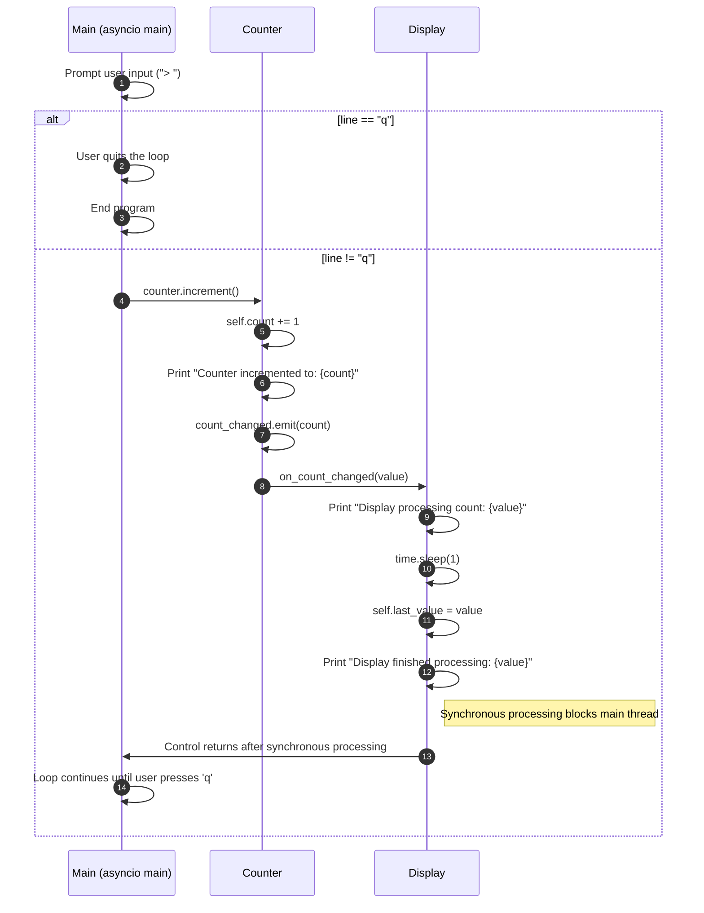

Use this as a starting point if you’re new to PynneX. There’s no threading or async complexity—just a straightforward emitter-listener mechanism.

---

## emitter_async.py [(source)](https://github.com/nexconnectio/pynnex/blob/main/examples/emitter_async.py)
**Purpose**: Showcases how to handle asynchronous listeners:
- Async listeners using `@nx_listener`(Qt alias: `@slot`, Pub/Sub alias: `@subscriber`) with `async def`
- Emitting emitters that trigger async processing
- Demonstrates asynchronous delays (`await asyncio.sleep`)

**What it demonstrates**:
- Emitter connection with asynchronous listeners
- Combination of @nx_listener decorator with async functions
- Non-blocking operation handling

**Scenario:**
- User interacts with Counter through a simple console input prompt
- Counter emits an emitter when its value changes, triggering the async on_count_changed method in AsyncDisplay class
- AsyncDisplay processes the new value asynchronously (with a 1-second simulated delay), without blocking the main thread

**Sequence:**
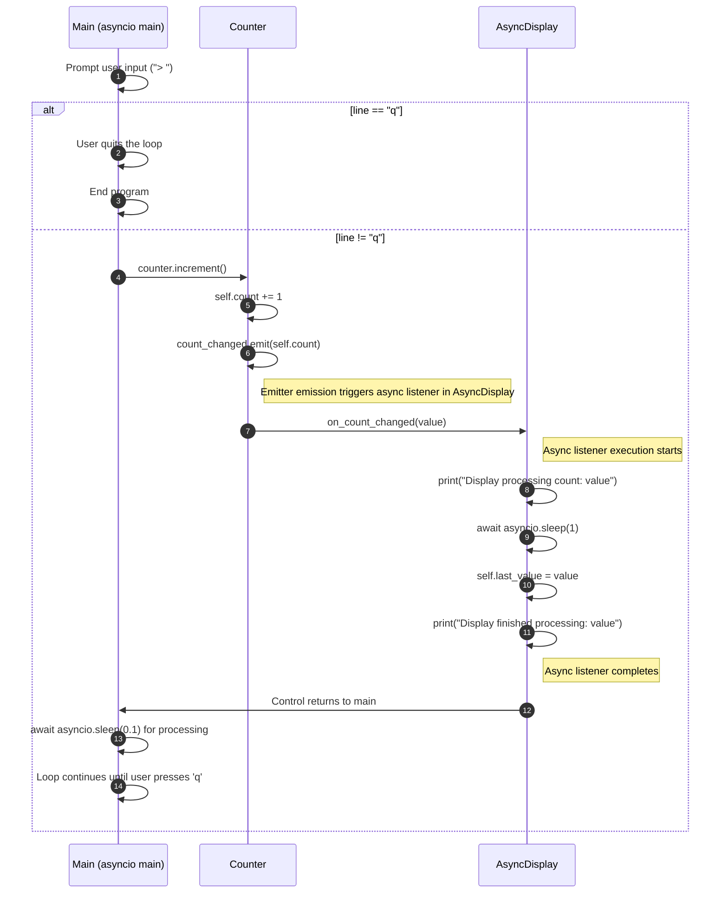

This example is ideal for learning how to integrate async operations into your event-driven code.

---

## emitter_function_listeners.py [(source)](https://github.com/nexconnectio/pynnex/blob/main/examples/emitter_function_listeners.py)
**Purpose**: Showcases how to use standalone functions as listeners:
- Using standalone functions as listeners without classes
- Demonstrates how to connect emitters to standalone functions
- Shows how to use functions as listeners without decorators

**What it demonstrates**:
- Flexibility of callable objects as listeners
- Simple way to use functions as listeners without classes
- Basic pattern for emitter-listener connections

**Scenario:**
- The user interacts with a console CLI (`Counter`) to increment the counter.
- The counter emits an emitter when the count changes, which triggers the `print_value` function.
- The function prints the current count value.

**Sequence:**
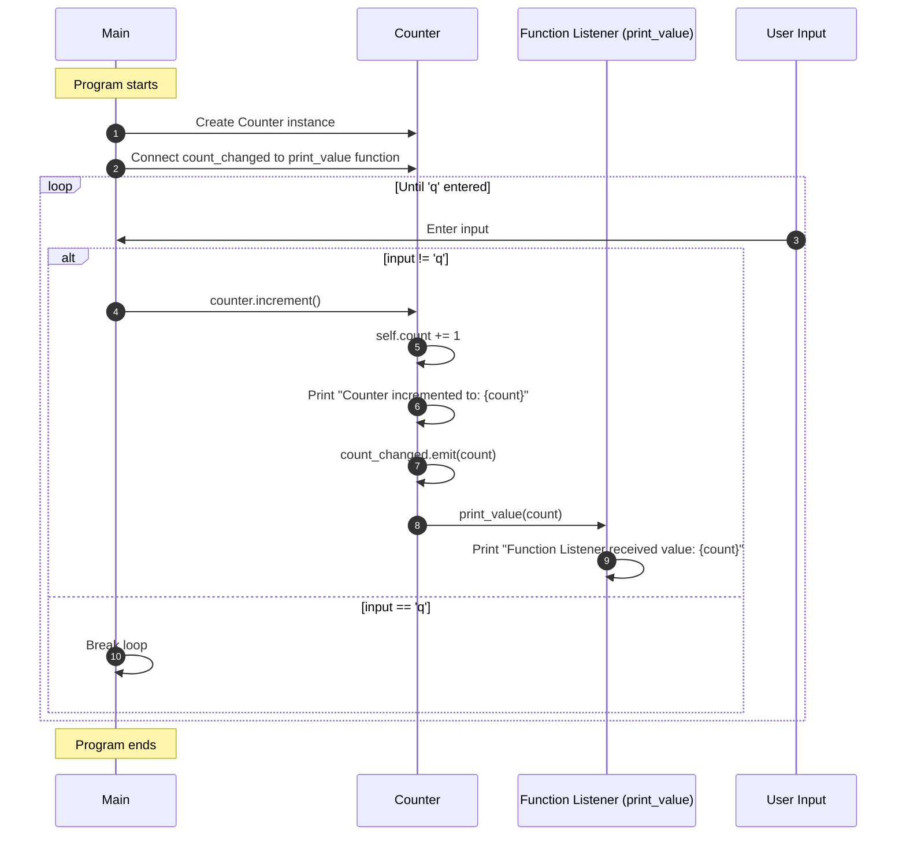

This example is a good starting point for learning how PynneX can be used in a functional programming style, especially for developers who prefer non-class-based approaches.

---

## emitter_lambda_listeners.py [(source)](https://github.com/nexconnectio/pynnex/blob/main/examples/emitter_lambda_listeners.py)
**Purpose**: showcases how to use lambda functions as listeners:
- Demonstrates how to connect emitters to lambda functions
- Shows how to use lambda functions as listeners without classes

**What it demonstrates**:
- Flexibility of lambda functions as listeners
- Quick implementation of simple inline tasks
- Emitter-listener system's flexibility

**Scenario:**
- The user interacts with a console CLI (`Counter`) to increment the counter.
- The counter emits an emitter when the count changes, which triggers the lambda function.
- The lambda function prints the current count value.

**Sequence:**
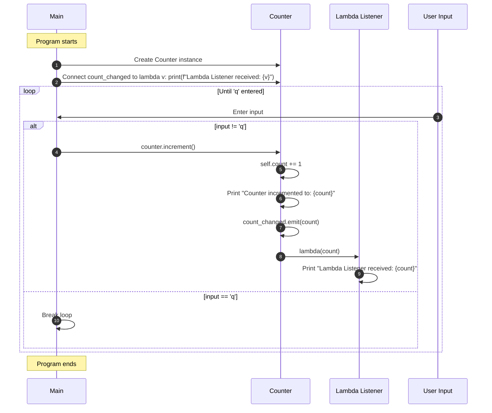

This example showcases PynneX's flexibility, particularly useful for quick listener implementations for simple tasks. Lambda functions allow for simple processing of emitters without the need for separate function or method definitions.

---

## thread_basic.py [(source)](https://github.com/nexconnectio/pynnex/blob/main/examples/thread_basic.py)
**Purpose**: Demonstrates thread-safe communication between main and worker threads using emitters:
- Main thread hosts a user interface object (`UserView`)
- Worker thread hosts data model and mediator (`UserModel`, `UserMediator`)
- Emitters and listeners handle thread-safe calls between threads

**What it demonstrates**:
- How emitters and listeners automatically handle thread boundary crossings
- Running a worker thread with its own event loop
- Ensuring UI updates occur in the main thread, even though data processing happens elsewhere

**Scenario:**
- The user interacts with a console CLI (`UserView`) to log in.
- The `UserView` emits an emitter when the user logs in, which triggers the `on_login_requested` listener in `UserModel`.
- The `UserModel` authenticates the user and emits an emitter when the authentication is successful, which triggers the `on_user_logged_in` listener in `UserView`.
- The `UserView` updates the UI to reflect the logged-in state.

**Sequence:**


This is useful for scenarios where you have a separate thread doing background work and need to update the main thread’s UI or state safely.

---

## thread_worker.py [(source)](https://github.com/nexconnectio/pynnex/blob/main/examples/thread_worker.py)
**Purpose**: Introduces the `@nx_with_worker`(aliases: `@with_worker`) pattern:
- A `ImageProcessor` class running in a worker thread
- Task queuing with `queue_task`
- Emitter emission from a worker thread to the main thread

**What it demonstrates**:
- Creating a dedicated worker event loop using `@nx_with_worker`
- Scheduling asynchronous tasks on the worker thread (`queue_task`)
- Emitting emitters from the worker to the main thread (`processing_complete`, `batch_complete`)
- Graceful start/stop of the worker

**Scenario:**
- The user interacts with a console CLI (`ImageViewer`) to start processing images.
- The `ImageViewer` emits an emitter when the user starts processing images, which triggers the `on_started` listener in `ImageProcessor`.
- The `ImageProcessor` processes the images asynchronously and emits an emitter when the processing is complete, which triggers the `on_image_processed` listener in `ImageViewer`.
- The `ImageViewer` updates the UI to reflect the processed images.

**Sequence:**
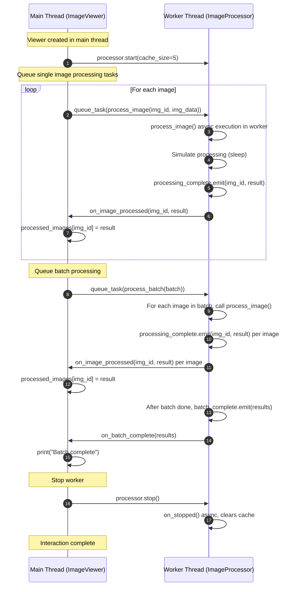

Ideal for learning how to perform background computations without blocking the main thread.

---

## stock_monitor_simple.py [(source)](https://github.com/nexconnectio/pynnex/blob/main/examples/stock_monitor_simple.py)
**Purpose**: A simple stock monitor example:
- Uses a worker to emit periodic “data processed” emitters
- A display object receiving those emitters and updating a value

**What it demonstrates**:
- A basic worker pattern with `@nx_with_worker`
- Connecting worker emitters to a display listener
- Observing data changes over time

**Scenario:**
- The user interacts with a console CLI (`DataDisplay`) to view the data changes.
- The `DataDisplay` receives the `data_processed` emitter from the `DataWorker` and updates the display.
- The `DataWorker` emits the `data_processed` emitter periodically, simulating data changes.

**Sequence:**
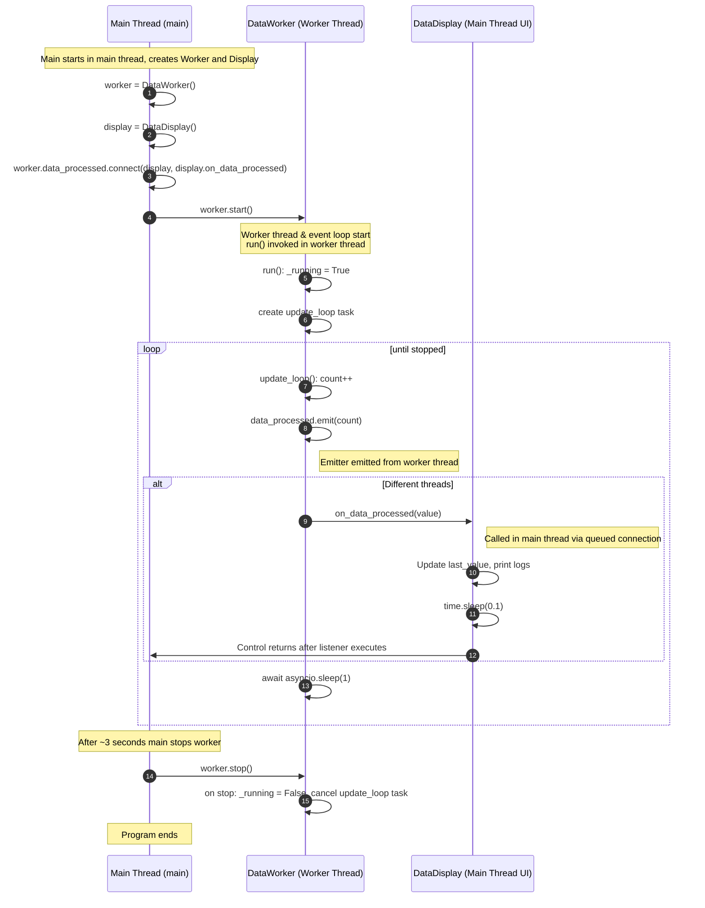

This is a stepping stone to more complex stock monitoring examples.

---

## stock_monitor_console.py [(source)](https://github.com/nexconnectio/pynnex/blob/main/examples/stock_monitor_console.py)
**Purpose**: A more advanced console-based stock monitor:
- Integrates `StockService`, `StockProcessor`, and `StockViewModel` from `stock_core.py`
- Provides a CLI for setting alerts, listing stocks, and monitoring price changes
- Demonstrates a three-component architecture:
  - `StockService`: Generates stock price updates in a worker thread
  - `StockProcessor`: Processes updates, applies alerts, and emits results
  - `StockViewModel`: Maintains state for the UI (in this case, a console UI)
  
**Screenshot:**
<div align="center">
  
  <p><em>Stock Monitor Console: Real-time price updates, alert configuration, and notification history in action</em></p>
</div>

**What it demonstrates**:
- Multi-threaded architecture with emitters crossing between threads
- How async/await is integrated with user input via an event loop
- Complex emitter/listener connections for a real-world scenario (stock updates and alerts)

**Scenario**: 
- The user interacts with a console CLI (`StockMonitorCLI`) to view and set alerts on stocks.
- `StockService` and `StockProcessor` run in worker threads, generating and processing stock prices.
- `StockViewModel` manages the UI state (prices, alerts) and communicates changes to the CLI.

**Sequence:**


This example is great for seeing how PynneX can be scaled up to more realistic, production-like use cases.

---

## stock_monitor_ui.py [(source)](https://github.com/nexconnectio/pynnex/blob/main/examples/stock_monitor_ui.py)
**Purpose**: Shows how PynneX integrates with a GUI framework (Kivy):
- Similar functionality to the console version, but with a graphical UI
- `StockView` as a Kivy widget updates UI elements when emitters fire
- `set_alert` and `remove_alert` emitters triggered from UI and handled by `StockProcessor`

**Screenshot:**
<div align="center">
  
  <p><em>Stock Monitor UI: Real-time price updates, alert configuration, and notification history in action</em></p>
</div>

**What it demonstrates**:
- Integrating PynneX with Kivy’s main loop and UI elements
- Thread-safe updates to UI from background workers
- Handling user input, setting alerts, and reflecting changes on the UI

**Scenario:**
- The user interacts with a Kivy GUI (`StockView`) to start processing stocks.
- The `StockView` emits an emitter when the user starts processing stocks, which triggers the `on_started` listener in `StockService`.
- The `StockService` processes the stocks asynchronously and emits an emitter when the processing is complete, which triggers the `on_stock_processed` listener in `StockViewModel`.
- The `StockViewModel` updates the UI to reflect the processed stocks.

**Usecase:**
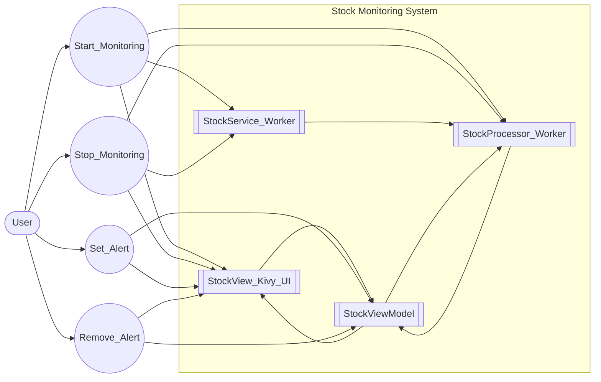

**Sequence:**
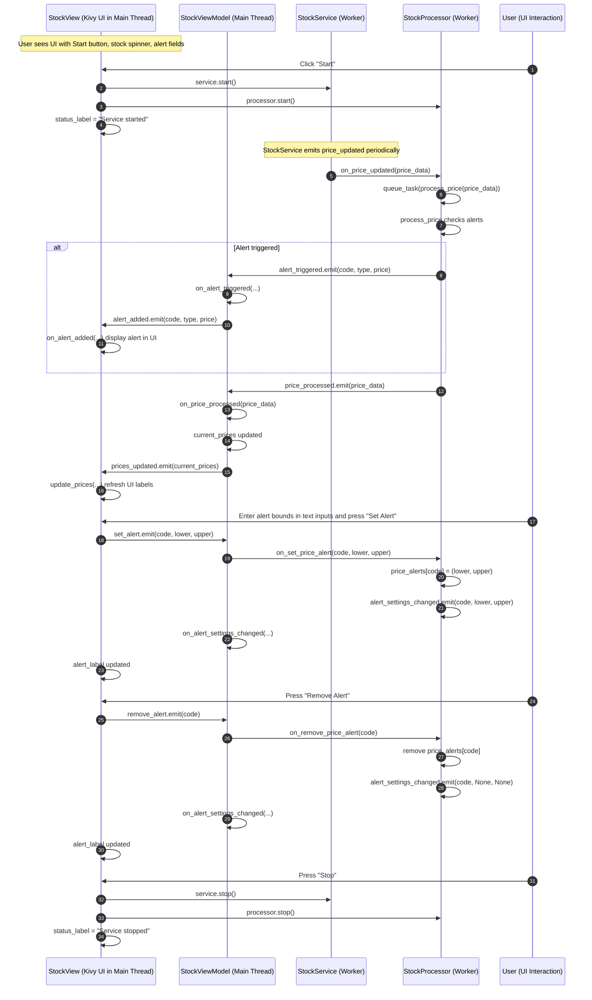
This is useful if you’re building a GUI application and want to keep UI responsive while performing background tasks.

---

## stock_core.py [(source)](https://github.com/nexconnectio/pynnex/blob/main/examples/stock_core.py)
**Purpose**: Core classes for stock monitoring logic:
- `StockService`: Generates random stock price updates in a worker thread
- `StockProcessor`: Processes these prices, triggers alerts based on user settings
- `StockViewModel`: Manages the current state of stock prices and alerts

**What it demonstrates**:
- Separation of concerns: generation of data (`StockService`), processing/alert logic (`StockProcessor`), and state management (`StockViewModel`)
- Each component uses emitters/listeners to communicate without direct dependencies

**Classes**:
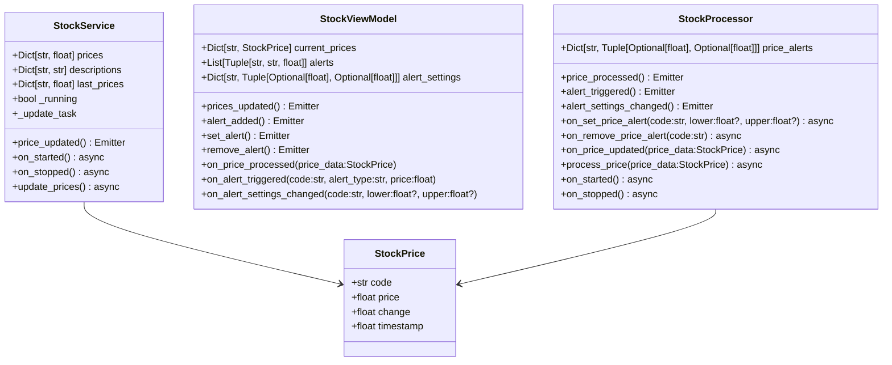
**Sequence:**
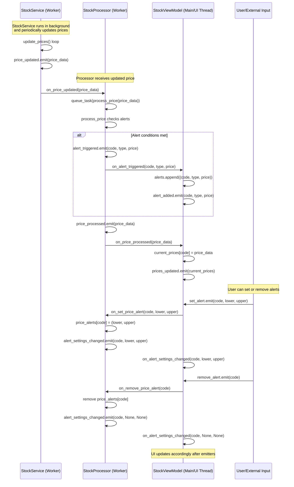
This example provides a strong architectural foundation for a real-time monitoring app.

---

## fastapi_socketio_simple.py [(source)](https://github.com/nexconnectio/pynnex/blob/main/examples/fastapi_socketio_simple.py)
**Purpose**: Demonstrates a minimal FastAPI & SocketIO integration with PynneX worker:
- Uses `@with_worker` to handle asynchronous berry checking tasks
- Shows how to integrate FastAPI, SocketIO, and PynneX worker
- Provides a simple web interface for task submission

**Screenshot:**
<div align="center">
  
  <p><em>FastAPI with Worker Simple: Real-time WebSocket communication with worker</em></p>
</div>

**What it demonstrates**:
- Setting up a FastAPI application with SocketIO
- Using PynneX worker for background task processing
- Real-time updates via WebSocket
- Basic HTML/JavaScript frontend integration

**Scenario:**
- User clicks a button to request berry checking
- Request is processed asynchronously in a worker thread
- Results are sent back to the browser in real-time

**Sequence:**
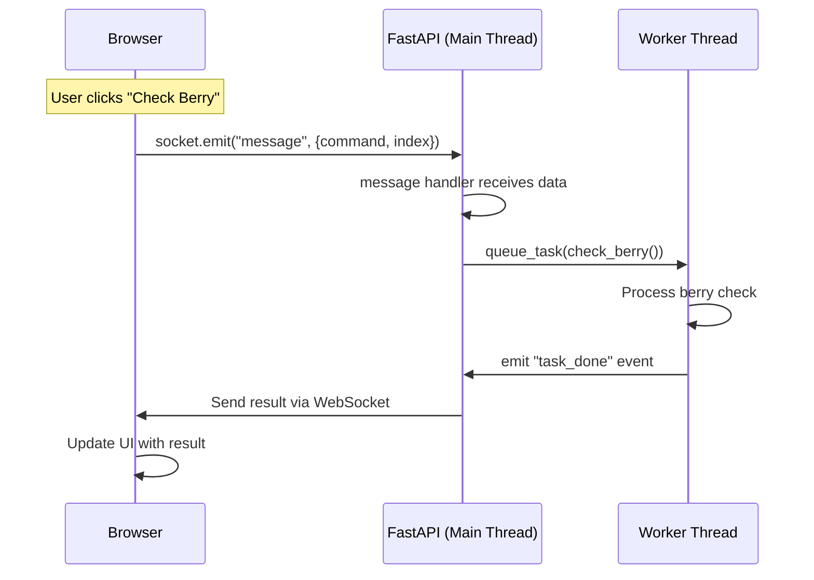

This example is perfect for learning how to:
1. Set up a minimal web application with FastAPI & SocketIO
2. Use PynneX worker for background processing
3. Handle real-time communication between server and client
4. Integrate with a simple web frontend

Required packages:
```bash
pip install fastapi python-socketio uvicorn
```

---

## fastapi_socketio_qr.py [(source)](https://github.com/nexconnectio/pynnex/blob/main/examples/fastapi_socketio_qr.py)
**Purpose**: Demonstrates QR code generation with FastAPI & SocketIO integration:
- Uses `@with_worker` to handle asynchronous QR code generation
- Shows real-time QR code updates via WebSocket
- Provides a simple web interface for QR code generation

**Screenshot:**
<div align="center">
  
  <p><em>FastAPI QR Code Generator: Real-time QR code generation with WebSocket communication</em></p>
</div>

**What it demonstrates**:
- Setting up a FastAPI application with SocketIO
- Using PynneX worker for QR code generation
- Real-time image updates via WebSocket
- Base64 image encoding/decoding
- Basic HTML/JavaScript frontend integration

**Scenario:**
- User clicks a button to request QR code generation
- Request is processed asynchronously in a worker thread
- Generated QR code is sent back to the browser in real-time as Base64 image

**Sequence:**
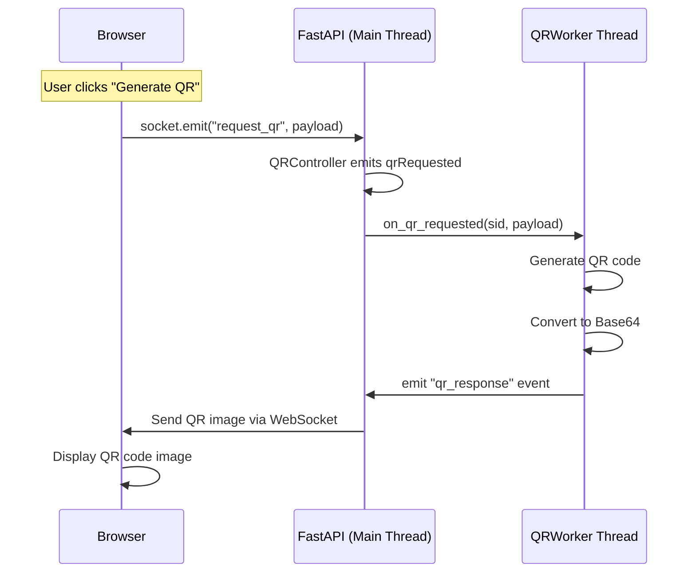

This example is perfect for learning how to:
1. Set up a web application with FastAPI & SocketIO
2. Use PynneX worker for image generation
3. Handle real-time image data communication
4. Integrate with a web frontend using Base64 images

Required packages:
```bash
pip install fastapi python-socketio uvicorn qrcode
```

---

## fastapi_socketio_stock_monitor.py [(source)](https://github.com/nexconnectio/pynnex/blob/main/examples/fastapi_socketio_stock_monitor.py)
**Purpose**: Demonstrates a full-featured stock monitoring web application:
- Uses FastAPI & SocketIO for real-time web interface
- Integrates with stock_core.py for core business logic
- Shows real-time price updates, candlestick charts, and price alerts
- Uses ag-Grid for interactive data grid and eCharts for candlestick visualization

**Screenshot:**
<div align="center">
  
  <p><em>FastAPI Stock Monitor: Real-time stock monitoring with interactive grid, candlestick chart, and price alerts</em></p>
</div>

**What it demonstrates**:
- Setting up a FastAPI application with SocketIO
- Using pynnex worker for stock data processing
- Real-time data updates via WebSocket
- Integration with third-party libraries (ag-Grid, eCharts)
- Complex UI interactions and state management
- Price alert system with real-time notifications

**Scenario:**
- User views real-time stock prices in an interactive grid
- Selecting a stock displays its candlestick chart
- User can set price alerts for selected stocks
- Real-time notifications when price alerts are triggered

**Sequence:**
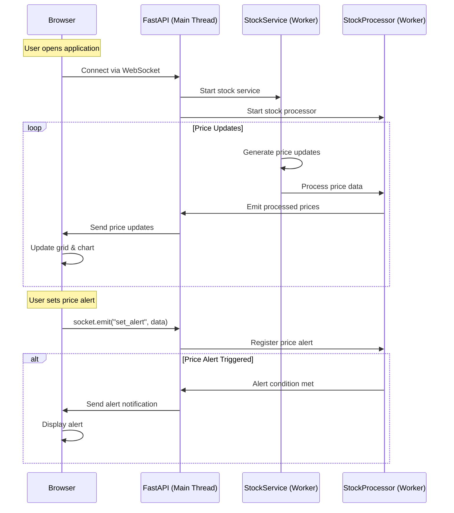

This example showcases:
1. Complex real-time web application architecture
2. Integration of multiple UI components
3. Real-time data processing and visualization
4. Interactive user experience with immediate feedback
5. Alert system with real-time notifications

Required packages:
```bash
pip install fastapi python-socketio uvicorn
```

Frontend dependencies (included via CDN):
- ag-Grid Community Edition
- eCharts
- Bootstrap 5

---

**In Summary:**
- **emitter_basic.py** and **emitter_async.py**: Start here to understand basic emitter/listener mechanics.
- **emitter_function_listeners.py** and **emitter_lambda_listeners.py**: Next steps showing flexible ways to use functions and lambdas as listeners.
- **thread_basic.py** and **thread_worker.py**: Learn about threading, event loops, and task queues.
- **stock_monitor_simple.py**: A minimal stock example using a worker.
- **stock_monitor_console.py** and **stock_monitor_ui.py**: Realistic, more complex examples that integrate multiple components, async processing, alerts, and UI/CLI interfaces.
- **stock_core.py**: Core domain logic extracted for reuse in different UIs, demonstrating best practices in modular design.

Use these examples in sequence to progressively gain expertise in PynneX's capabilities.
