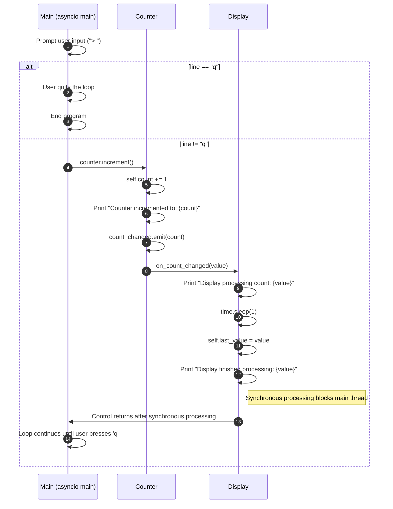
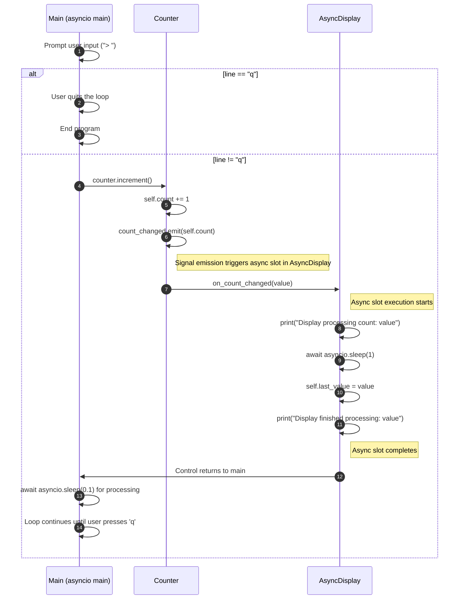
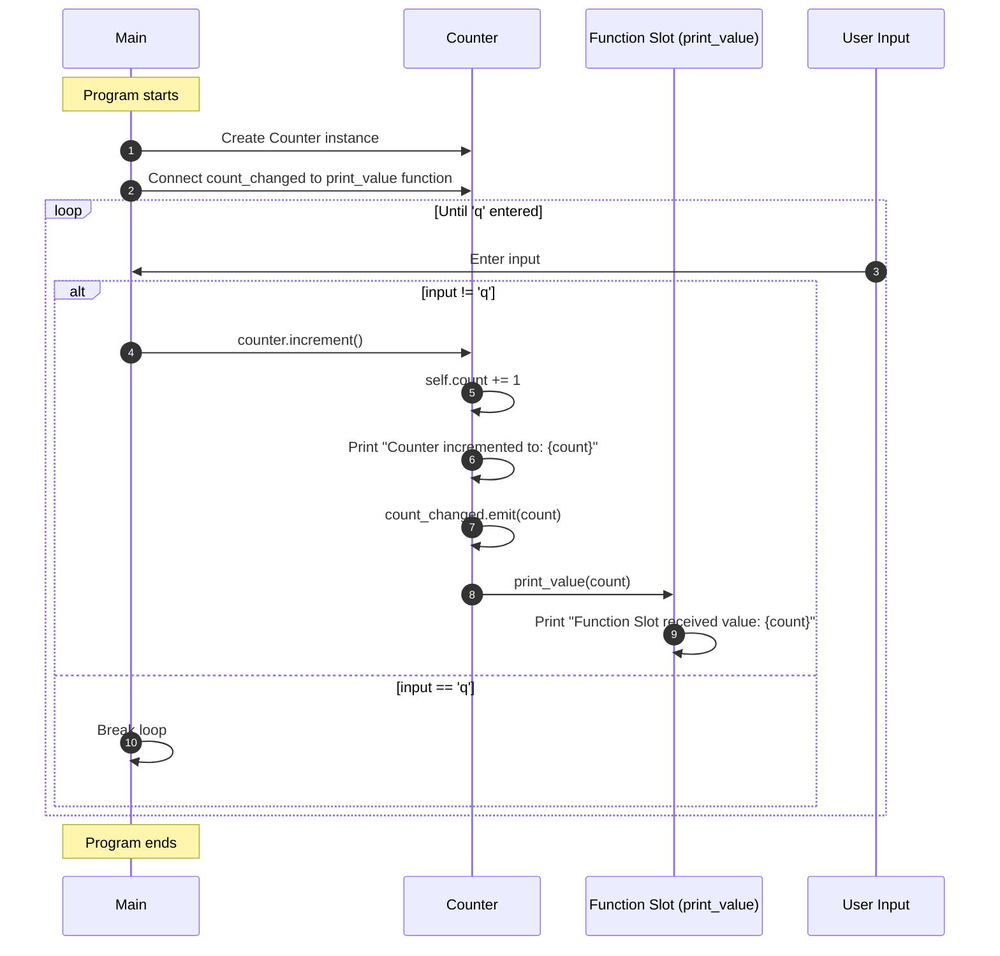
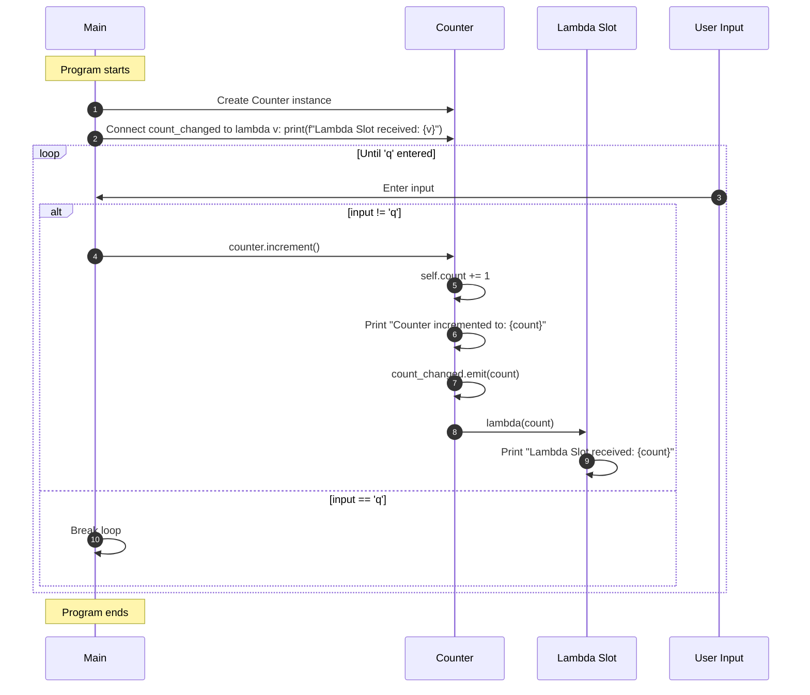
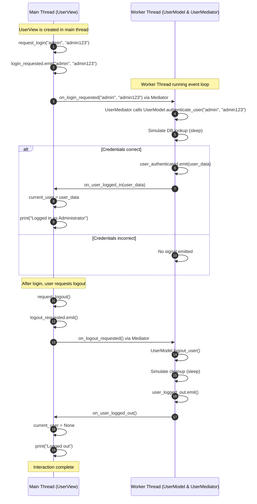
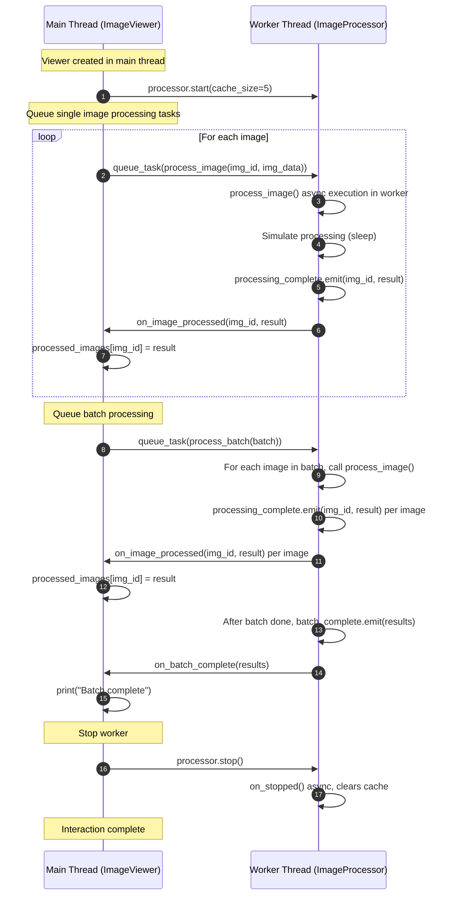
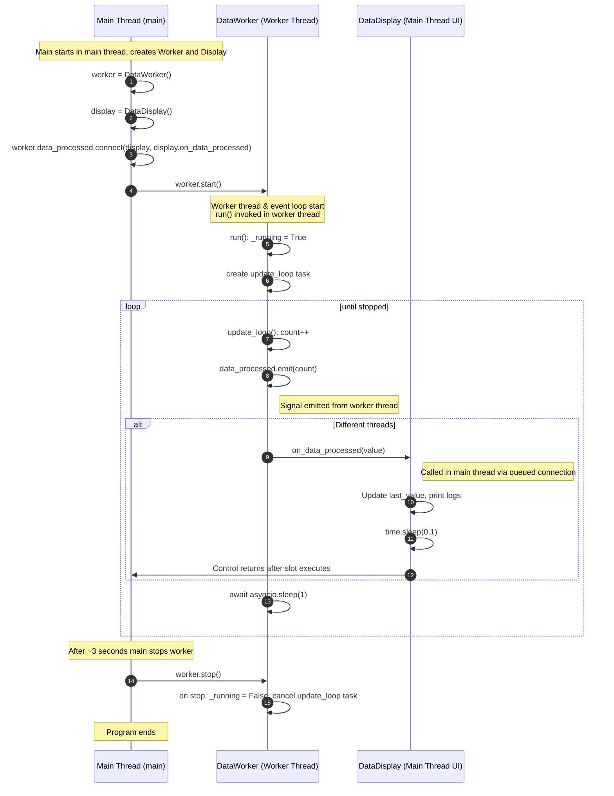
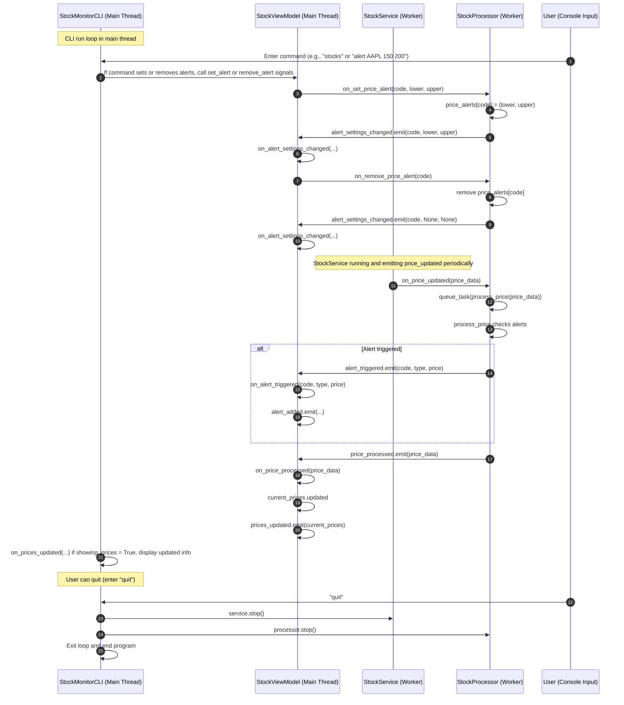
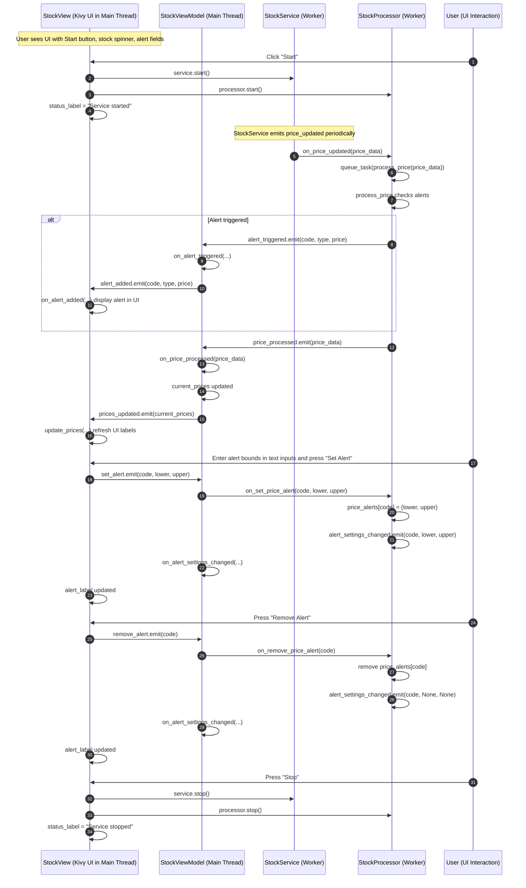
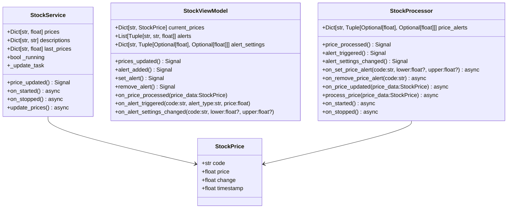

This document provides an overview and explanation of the included examples. Each example demonstrates various aspects of using Pynnex, from basic signal-slot handling to more complex threaded worker patterns and UI integrations.

# Table of Contents
  
- [Table of Contents](#table-of-contents)
    - [signal\_basic.py (source)](#signal_basicpy-source)
  - [signal\_async.py (source)](#signal_asyncpy-source)
  - [signal\_function\_slots.py (source)](#signal_function_slotspy-source)
  - [signal\_lambda\_slots.py (source)](#signal_lambda_slotspy-source)
  - [thread\_basic.py (source)](#thread_basicpy-source)
  - [thread\_worker.py (source)](#thread_workerpy-source)
  - [stock\_monitor\_simple.py (source)](#stock_monitor_simplepy-source)
  - [stock\_monitor\_console.py (source)](#stock_monitor_consolepy-source)
  - [stock\_monitor\_ui.py (source)](#stock_monitor_uipy-source)
  - [stock\_core.py (source)](#stock_corepy-source)

---

### signal_basic.py [(source)](https://github.com/nexconnectio/pynnex/blob/main/examples/signal_basic.py)
**Purpose**: Introduces the most basic usage of Pynnex:
- Defining signals on a class (`@nx_signal`)
- Defining synchronous slots
- Connecting signals to slots and emitting signals

**What it demonstrates**:
- Simple increment of a counter
- Immediate synchronous slot response

**Scenario:**
- User interacts with Counter through a simple console input prompt
- Counter emits a signal when its value changes, triggering the on_count_changed method in Display class
- Display processes the new value synchronously (with a 1-second simulated delay), blocking the main thread

**Sequence:**

Use this as a starting point if you’re new to Pynnex. There’s no threading or async complexity—just a straightforward signal-slot mechanism.

---

## signal_async.py [(source)](https://github.com/nexconnectio/pynnex/blob/main/examples/signal_async.py)
**Purpose**: Showcases how to handle asynchronous slots:
- Async slots using `@nx_slot` with `async def`
- Emitting signals that trigger async processing
- Demonstrates asynchronous delays (`await asyncio.sleep`)

**What it demonstrates**:
- Signal connection with asynchronous slots
- Combination of @nx_slot decorator with async functions
- Non-blocking operation handling

**Scenario:**
- User interacts with Counter through a simple console input prompt
- Counter emits a signal when its value changes, triggering the async on_count_changed method in AsyncDisplay class
- AsyncDisplay processes the new value asynchronously (with a 1-second simulated delay), without blocking the main thread

**Sequence:**

This example is ideal for learning how to integrate async operations into your event-driven code.

---

## signal_function_slots.py [(source)](https://github.com/nexconnectio/pynnex/blob/main/examples/signal_function_slots.py)
**Purpose**: Showcases how to use standalone functions as slots:
- Using standalone functions as slots without classes
- Demonstrates how to connect signals to standalone functions
- Shows how to use functions as slots without decorators

**What it demonstrates**:
- Flexibility of callable objects as slots
- Simple way to use functions as slots without classes
- Basic pattern for signal-slot connections

**Scenario:**
- The user interacts with a console CLI (`Counter`) to increment the counter.
- The counter emits a signal when the count changes, which triggers the `print_value` function.
- The function prints the current count value.

**Sequence:**

This example is a good starting point for learning how Pynnex can be used in a functional programming style, especially for developers who prefer non-class-based approaches.

---

## signal_lambda_slots.py [(source)](https://github.com/nexconnectio/pynnex/blob/main/examples/signal_lambda_slots.py)
**Purpose**: showcases how to use lambda functions as slots:
- Demonstrates how to connect signals to lambda functions
- Shows how to use lambda functions as slots without classes

**What it demonstrates**:
- Flexibility of lambda functions as slots
- Quick implementation of simple inline tasks
- Signal-slot system's flexibility

**Scenario:**
- The user interacts with a console CLI (`Counter`) to increment the counter.
- The counter emits a signal when the count changes, which triggers the lambda function.
- The lambda function prints the current count value.

**Sequence:**

This example showcases Pynnex's flexibility, particularly useful for quick slot implementations for simple tasks. Lambda functions allow for simple processing of signals without the need for separate function or method definitions.

---

## thread_basic.py [(source)](https://github.com/nexconnectio/pynnex/blob/main/examples/thread_basic.py)
**Purpose**: Demonstrates thread-safe communication between main and worker threads using signals:
- Main thread hosts a user interface object (`UserView`)
- Worker thread hosts data model and mediator (`UserModel`, `UserMediator`)
- Signals and slots handle thread-safe calls between threads

**What it demonstrates**:
- How signals and slots automatically handle thread boundary crossings
- Running a worker thread with its own event loop
- Ensuring UI updates occur in the main thread, even though data processing happens elsewhere

**Scenario:**
- The user interacts with a console CLI (`UserView`) to log in.
- The `UserView` emits a signal when the user logs in, which triggers the `on_login_requested` slot in `UserModel`.
- The `UserModel` authenticates the user and emits a signal when the authentication is successful, which triggers the `on_user_logged_in` slot in `UserView`.
- The `UserView` updates the UI to reflect the logged-in state.

**Sequence:**

This is useful for scenarios where you have a separate thread doing background work and need to update the main thread’s UI or state safely.

---

## thread_worker.py [(source)](https://github.com/nexconnectio/pynnex/blob/main/examples/thread_worker.py)
**Purpose**: Introduces the `@nx_with_worker` pattern:
- A `ImageProcessor` class running in a worker thread
- Task queuing with `queue_task`
- Signal emission from a worker thread to the main thread

**What it demonstrates**:
- Creating a dedicated worker event loop using `@nx_with_worker`
- Scheduling asynchronous tasks on the worker thread (`queue_task`)
- Emitting signals from the worker to the main thread (`processing_complete`, `batch_complete`)
- Graceful start/stop of the worker

**Scenario:**
- The user interacts with a console CLI (`ImageViewer`) to start processing images.
- The `ImageViewer` emits a signal when the user starts processing images, which triggers the `on_started` slot in `ImageProcessor`.
- The `ImageProcessor` processes the images asynchronously and emits a signal when the processing is complete, which triggers the `on_image_processed` slot in `ImageViewer`.
- The `ImageViewer` updates the UI to reflect the processed images.

**Sequence:**

Ideal for learning how to perform background computations without blocking the main thread.

---

## stock_monitor_simple.py [(source)](https://github.com/nexconnectio/pynnex/blob/main/examples/stock_monitor_simple.py)
**Purpose**: A simple stock monitor example:
- Uses a worker to emit periodic “data processed” signals
- A display object receiving those signals and updating a value

**What it demonstrates**:
- A basic worker pattern with `@nx_with_worker`
- Connecting worker signals to a display slot
- Observing data changes over time

**Scenario:**
- The user interacts with a console CLI (`DataDisplay`) to view the data changes.
- The `DataDisplay` receives the `data_processed` signal from the `DataWorker` and updates the display.
- The `DataWorker` emits the `data_processed` signal periodically, simulating data changes.

**Sequence:**

This is a stepping stone to more complex stock monitoring examples.

---

## stock_monitor_console.py [(source)](https://github.com/nexconnectio/pynnex/blob/main/examples/stock_monitor_console.py)
**Purpose**: A more advanced console-based stock monitor:
- Integrates `StockService`, `StockProcessor`, and `StockViewModel` from `stock_core.py`
- Provides a CLI for setting alerts, listing stocks, and monitoring price changes
- Demonstrates a three-component architecture:
  - `StockService`: Generates stock price updates in a worker thread
  - `StockProcessor`: Processes updates, applies alerts, and emits results
  - `StockViewModel`: Maintains state for the UI (in this case, a console UI)
  
**Screenshot:**

  
  
<em>Stock Monitor Console: Real-time price updates, alert configuration, and notification history in action</em>

**What it demonstrates**:
- Multi-threaded architecture with signals crossing between threads
- How async/await is integrated with user input via an event loop
- Complex signal/slot connections for a real-world scenario (stock updates and alerts)

**Scenario**: 
- The user interacts with a console CLI (`StockMonitorCLI`) to view and set alerts on stocks.
- `StockService` and `StockProcessor` run in worker threads, generating and processing stock prices.
- `StockViewModel` manages the UI state (prices, alerts) and communicates changes to the CLI.

**Sequence:**

This example is great for seeing how Pynnex can be scaled up to more realistic, production-like use cases.

---

## stock_monitor_ui.py [(source)](https://github.com/nexconnectio/pynnex/blob/main/examples/stock_monitor_ui.py)
**Purpose**: Shows how Pynnex integrates with a GUI framework (Kivy):
- Similar functionality to the console version, but with a graphical UI
- `StockView` as a Kivy widget updates UI elements when signals fire
- `set_alert` and `remove_alert` signals triggered from UI and handled by `StockProcessor`

**Screenshot:**

  
  
<em>Stock Monitor UI: Real-time price updates, alert configuration, and notification history in action</em>

**What it demonstrates**:
- Integrating Pynnex with Kivy’s main loop and UI elements
- Thread-safe updates to UI from background workers
- Handling user input, setting alerts, and reflecting changes on the UI

**Scenario:**
- The user interacts with a Kivy GUI (`StockView`) to start processing stocks.
- The `StockView` emits a signal when the user starts processing stocks, which triggers the `on_started` slot in `StockService`.
- The `StockService` processes the stocks asynchronously and emits a signal when the processing is complete, which triggers the `on_stock_processed` slot in `StockViewModel`.
- The `StockViewModel` updates the UI to reflect the processed stocks.

**Usecase:**

**Sequence:**

This is useful if you’re building a GUI application and want to keep UI responsive while performing background tasks.

---

## stock_core.py [(source)](https://github.com/nexconnectio/pynnex/blob/main/examples/stock_core.py)
**Purpose**: Core classes for stock monitoring logic:
- `StockService`: Generates random stock price updates in a worker thread
- `StockProcessor`: Processes these prices, triggers alerts based on user settings
- `StockViewModel`: Manages the current state of stock prices and alerts

**What it demonstrates**:
- Separation of concerns: generation of data (`StockService`), processing/alert logic (`StockProcessor`), and state management (`StockViewModel`)
- Each component uses signals/slots to communicate without direct dependencies

**Classes**:

**Sequence:**

This example provides a strong architectural foundation for a real-time monitoring app.

---

**In Summary:**
- **signal_basic.py** and **signal_async.py**: Start here to understand basic signal/slot mechanics.
- **signal_function_slots.py** and **signal_lambda_slots.py**: Next steps showing flexible ways to use functions and lambdas as slots.
- **thread_basic.py** and **thread_worker.py**: Learn about threading, event loops, and task queues.
- **stock_monitor_simple.py**: A minimal stock example using a worker.
- **stock_monitor_console.py** and **stock_monitor_ui.py**: Realistic, more complex examples that integrate multiple components, async processing, alerts, and UI/CLI interfaces.
- **stock_core.py**: Core domain logic extracted for reuse in different UIs, demonstrating best practices in modular design.

Use these examples in sequence to progressively gain expertise in Pynnex's capabilities.
